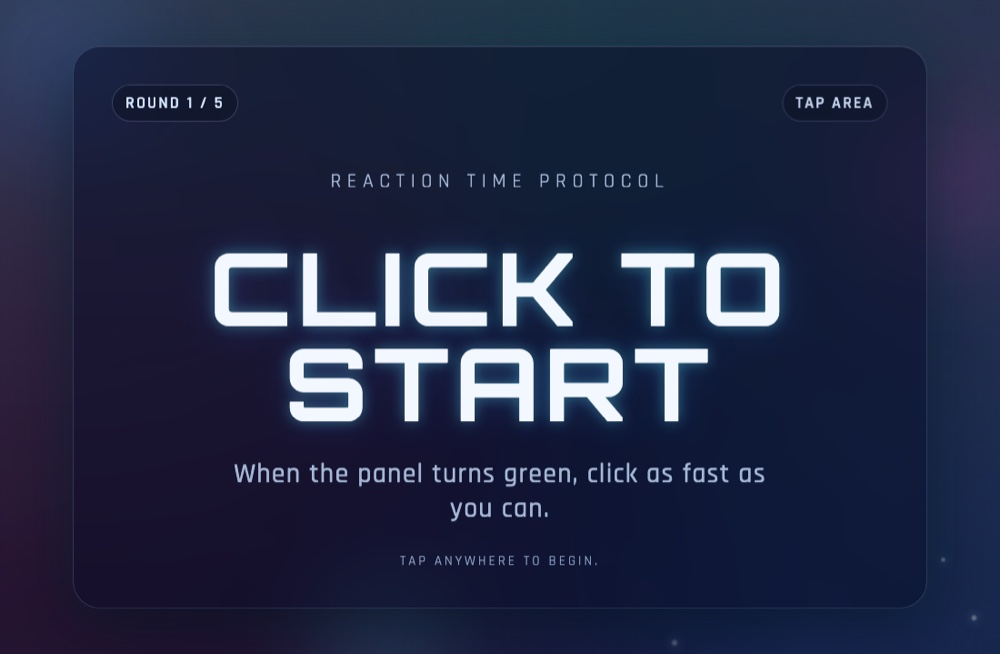

# Reaction Time Test

**▶ [Try it](https://renrenmimi.github.io/Reaction/)** — runs in your browser, nothing to install.

How fast are you, really? Wait for the screen to turn green, then click as fast as you can.

## How it works

1. Click to start
2. The screen holds on red for a random interval — **don't jump the gun**
3. The moment it turns green, click
4. Click too early and you get a "Too Soon!"

## Tech

One `index.html` file.
